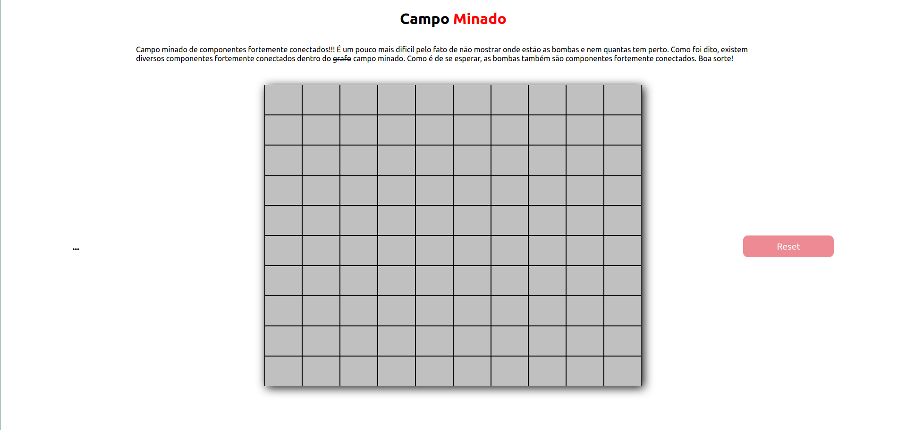
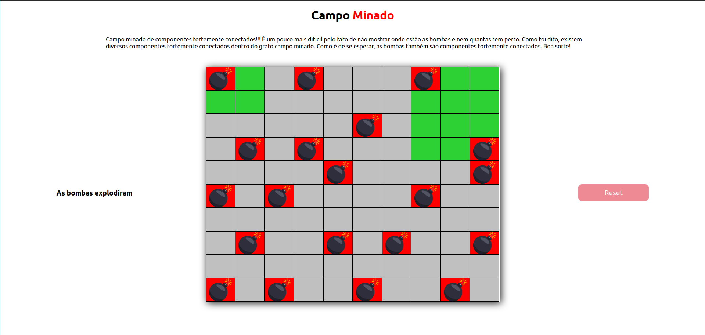
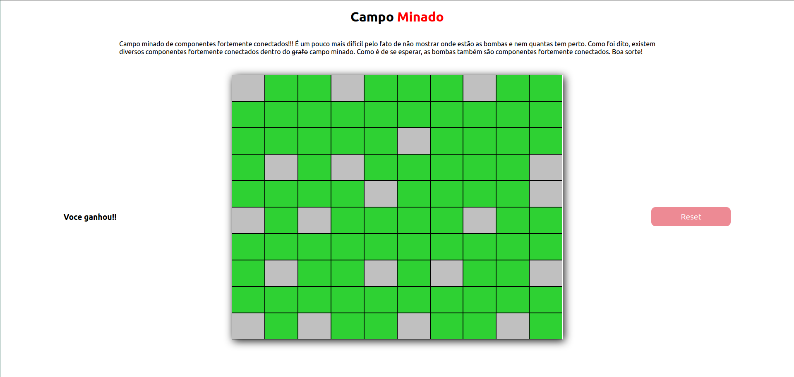

# Campo Minado

**Número da Lista**: 10<br>
**Conteúdo da Disciplina**: Grafos<br>

## Alunos
|Matrícula | Aluno |
| -- | -- |
| 15/0120371  |  Bruno Oliveira Dantas |
| 17/0031438 |  Dâmaso Júnio Pereira Brasileo |

## Sobre 
O **Campo Minado** remete ao antigo jogo de Campo Minado conhecido por muitas pessoas. É um campo repleto de Componentes fortemente conectados, mas um desses componentes é justamente o Componente de BOMBAS. Que faz com que o jogador obviamente perca o jogo =). 

## Screenshots







## Instalação 
**Linguagem**: JavaScript<br>
**Framework**: ReactJS<br>

Para instalação do projeto, é necessário executar os seguintes comandos:
```
git clone https://github.com/projeto-de-algoritmos/Grafos2-CampoMinado

cd Grafos2-CampoMinado

yarn install
```

## Uso 

Para execução do projeto é necessário, após a instalação:
```
cd Grafos2-CampoMinado

yarn start
```

## Outros 
O comando `yarn` pode ser trocado por `npm`:
```
npm install

npm start
```

É necessário ter o `NPM` ou `YARN` instalado.
